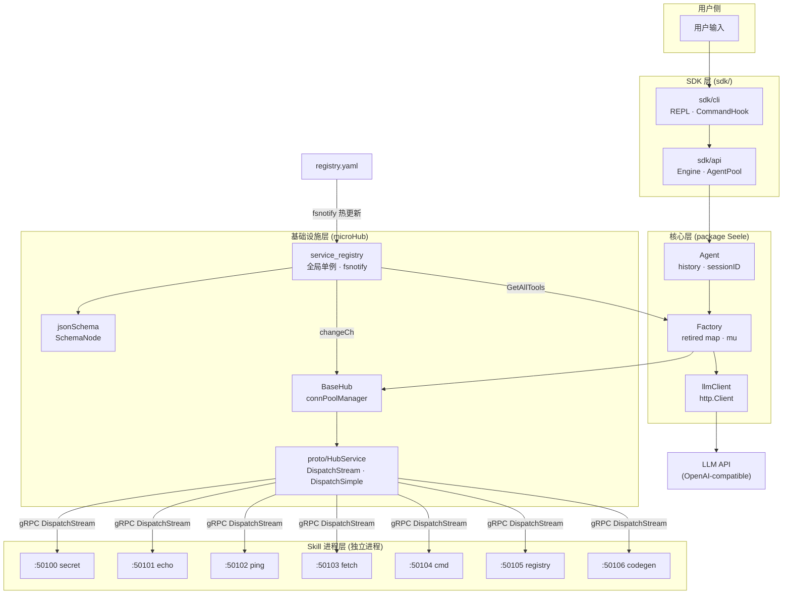
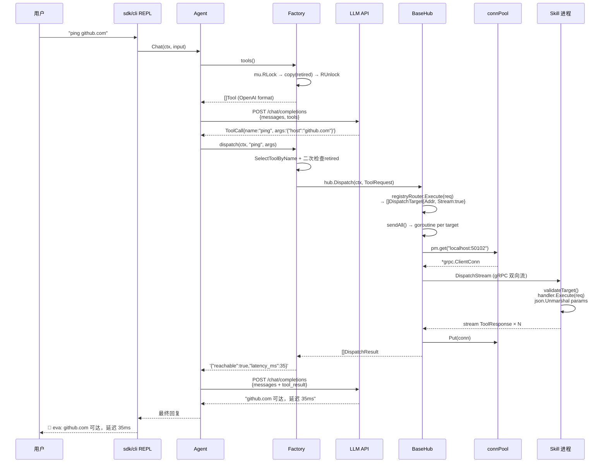
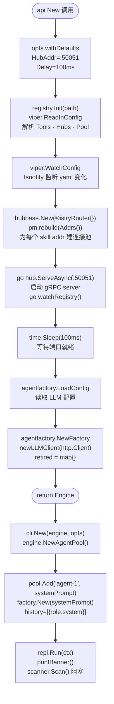
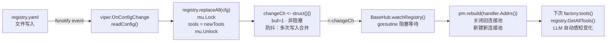

这个readme是seele自己写的，我觉得企业级名不副实就删掉了
【Seele——一个Go 语言 Agent 框架，对skill微服务管理，目前不支持除了skill之外的其他功能（这是运行视频）】 https://www.bilibili.com/video/BV1roPHztEiL/?share_source=copy_web&vd_source=34c7d660051de8fffbe62ac8172ffd5f
基于对项目代码的深入分析，我发现实际功能比原 README 描述的更丰富。以下是更新后的完整 README：

# Seele

> **一个基于 microHub 的 AI Agent 框架**
>
> gRPC 进程隔离的 skill 体系 · OpenAI-compatible LLM · 热插拔工具注册

---

## 目录

- [架构概览](#架构概览)
- [分层架构](#分层架构)
- [数据流](#数据流)
- [快速开始](#快速开始)
- [配置说明](#配置说明)
- [启动流程详解](#启动流程详解)
- [SDK 使用](#sdk-使用)
- [开发新 Skill](#开发新-skill)
- [设计决策](#设计决策)

---

## 架构概览

Seele 将 AI Agent 的对话能力与可扩展的工具生态解耦。Agent 通过标准 OpenAI function calling 协议与 LLM 交互，LLM 产生的 tool_call 经由 microHub 路由到独立的 skill 进程执行，结果以 gRPC 流式返回。



---

## 分层架构

```mermaid
graph LR
    subgraph L4["L4 · 入口层"]
        MAIN["cmd/main.go<br/>35行 · 信号处理 · 配置拼接"]
    end

    subgraph L3["L3 · SDK 层"]
        SDKAPI["sdk/api<br/>Engine · AgentPool<br/>QuickChat · Skills"]
        SDKCLI["sdk/cli<br/>REPL · Run(ctx)<br/>内置命令 · Banner"]
    end

    subgraph L2["L2 · 核心库层"]
        AGENT["Agent<br/>Chat() · history[]<br/>非并发安全"]
        FACTORY["Factory<br/>tools() · dispatch()<br/>buildParameters()<br/>并发安全(RWMutex)"]
        LLMC["llmClient<br/>POST /chat/completions<br/>Timeout 60s"]
        MODEL["model.go<br/>Message · ToolCall<br/>Tool · chatRequest"]
    end

    subgraph L1["L1 · 基础设施层 (microHub)"]
        BHUB["BaseHub<br/>connPoolManager<br/>sendAll() 并发派发<br/>watchRegistry()"]
        SREG["service_registry<br/>全局单例<br/>RWMutex · changeCh"]
        JSCHEMA["jsonSchema<br/>SchemaNode<br/>Validate()"]
        PROTO2["proto/HubService<br/>ToolRequest · ToolResponse<br/>ErrorDetail"]
    end

    subgraph L0["L0 · Skill 进程层"]
        TOOLS["example_tools/*<br/>BaseTool · ToolHandler<br/>独立 gRPC 进程"]
    end

    L4 --> L3 --> L2 --> L1 --> L0
```



---

## 数据流

### 工具调用完整链路



### 初始化流程



### 热更新流程



---

## 快速开始

### 前置条件

- Go 1.24+
- 一个 OpenAI-compatible LLM API（本地 Ollama / OpenAI / 其他兼容接口均可）
- 各 skill 进程已启动（见下方）

### 目录结构

```
Seele/
├── cmd/
│   └── main.go              # 程序入口（35行）
├── sdk/
│   ├── api/                 # Engine SDK
│   └── cli/                 # REPL SDK
├── example_tools/           # 示例 skill 进程
│   ├── ping/
│   ├── fetch/
│   ├── cmd/
│   ├── echo/
│   ├── suka_secret/
│   ├── registry_changer/
│   └── tool_coder/
├── config_example/
│   └── registry.yaml        # skill 注册表（必须配置）
├── .env                     # 环境变量（必须配置）
└── makefile / tools.ps1     # 进程管理脚本
```

### 第一步：配置环境变量

复制并编辑 `.env` 文件：

```bash
# .env

# LLM API 配置
LLM_BASE_URL=https://api.openai.com/v1     # 或本地: http://localhost:11434/v1
LLM_API_KEY=sk-xxxxxxxxxxxxxxxxxxxx
LLM_MODEL=gpt-4o                           # 或 llama3, qwen2.5 等

# Agent 人设
SYSTEM_PROMPT=你是一个名叫 eva 的 AI 助手，可以使用工具帮助用户完成任务。
BOT_NAME=eva

# microHub 配置
HUB_ADDR=:50051                            # Hub gRPC 监听地址
REGISTRY_PATH=./config_example/registry.yaml

# skill 进程工作目录（cmd skill 使用）
CMD_SKILL_DIR=.
```

### 第二步：配置 registry.yaml

```yaml
# config_example/registry.yaml
services:
  tools:
    - name: "ping"
      addr: "localhost:50102"
      method: "Ping"
      description: "网络连通性检测"
      input_schema: |
        {
          "type": "object",
          "data": {
            "host":  { "type": "string" },
            "count": { "type": "integer", "default": 4, "min": 1, "max": 10 }
          },
          "required": ["host"]
        }

  hubs:
    - name: "main_hub"
      addr: "localhost:50051"

pool:
  grpc_conn:
    min_size: 24
    max_size: 130
    # ... 见配置说明章节
```

### 第三步：启动 skill 进程

**Linux / macOS（make）：**

```bash
make up       # 启动所有 skill
make status   # 检查端口状态
make run      # 启动 skill + 主程序
```

**Windows（PowerShell）：**

```powershell
# 首次运行需要设置执行策略
Set-ExecutionPolicy -Scope CurrentUser RemoteSigned

.\tools.ps1 up        # 启动所有 skill
.\tools.ps1 status    # 检查端口状态
.\tools.ps1 run       # 启动 skill + 主程序
```

### 第四步：运行

```bash
go run ./cmd
```

预期输出：

```
╔══════════════════════════════════════╗
║           Seele · eva                ║
║   输入 help 查看可用命令              ║
╚══════════════════════════════════════╝

🔧 已加载工具: ping, fetch, cmd, echo, ...

[eva] > ping 一下 github.com
🤖 eva: github.com 可达，平均延迟 35ms，无丢包。

[eva] > skills
🔧 可用工具:
  ping     · localhost:50102
  fetch    · localhost:50103
  ...
```

---

## 配置说明

### `.env` 完整字段

| 字段 | 必填 | 默认值 | 说明 |
|------|------|--------|------|
| `LLM_BASE_URL` | ✅ | — | LLM API 地址，末尾不加 `/` |
| `LLM_API_KEY` | ✅ | — | API Key，本地模型填任意字符串 |
| `LLM_MODEL` | ✅ | — | 模型名称，需支持 function calling |
| `LLM_TIMEOUT` | ❌ | `60s` | LLM 请求超时时间 |
| `SYSTEM_PROMPT` | ✅ | — | Agent 系统提示词 |
| `BOT_NAME` | ❌ | `eva` | REPL 显示的 Agent 名称 |
| `HUB_ADDR` | ❌ | `:50051` | microHub gRPC 监听地址 |
| `HUB_STARTUP_DELAY` | ❌ | `100ms` | Hub 启动等待时间 |
| `REGISTRY_PATH` | ✅ | — | registry.yaml 路径 |
| `CMD_SKILL_DIR` | ❌ | `.` | cmd skill 的工作目录 |
| `TOOLS_DIR` | ❌ | `./example_tools` | codegen skill 生成代码的目录 |

### `registry.yaml` 完整字段

#### `services.tools[]` — skill 注册

```yaml
services:
  tools:
    - name: "ping"               # 必填：唯一标识，与 ToolHandler.ServiceName() 一致
      addr: "localhost:50102"    # 必填：skill gRPC 地址
      method: "Ping"             # 必填：方法名（日志/按 method 路由时使用）
      description: "..."         # 可选：工具描述，会传给 LLM
      input_schema: |            # 可选：输入参数 schema（见下方格式）
        { ... }
      output_schema: |           # 可选：输出结果 schema（文档用途）
        { ... }
```

#### `input_schema` 格式（microHub SchemaNode）

> ⚠️ 注意：microHub 使用自定义格式，**不是**标准 JSON Schema。字段放在 `data` 而非 `properties`，范围用 `min`/`max` 而非 `minimum`/`maximum`。Seele 在内部自动完成转换。

```yaml
input_schema: |
  {
    "type": "object",
    "data": {
      "host": {
        "type": "string"                   # 支持: string · integer · number · boolean · object · array
      },
      "count": {
        "type": "integer",
        "default": 4,                      # 默认值
        "min": 1,                          # 最小值（integer/number）
        "max": 10                          # 最大值（integer/number）
      },
      "mode": {
        "type": "string",
        "enum": ["fast", "slow", "auto"]   # 枚举值
      },
      "tags": {
        "type": "array",
        "items": { "type": "string" }      # array 的元素类型
      },
      "options": {
        "type": "object",                  # 嵌套对象
        "data": {
          "timeout": { "type": "integer" }
        }
      }
    },
    "required": ["host"]                   # 必填字段
  }
```

**schema 字段与 OpenAI 格式的映射关系：**

```
microHub SchemaNode          OpenAI function parameters
─────────────────────────────────────────────────────
data          →              properties
min           →              minimum
max           →              maximum
其余字段       →              保持不变（type · default · enum · required）
```

#### `pool.grpc_conn` — 连接池参数

```yaml
pool:
  grpc_conn:
    min_size: 24              # 每个 skill addr 的最小连接数
    max_size: 130             # 每个 skill addr 的最大连接数
    idle_buffer_factor: 0.55  # 空闲缓冲比例：空闲连接 = max × factor
    survive_time_sec: 180     # 空闲连接最大存活时间（秒）
    monitor_interval_sec: 6   # 健康检查间隔（秒）
    max_retries: 3            # 连接失败最大重试次数
    retry_interval_ms: 200    # 重试间隔（毫秒）
    reconnect_on_get: false   # 取连接时是否强制重连（gRPC 自带重连，通常设 false）
```

> 开发/测试环境可以大幅降低连接池大小：`min_size: 2, max_size: 10`

---

## 启动流程详解

以下是 `go run ./cmd` 执行后，系统内部的完整初始化顺序。

### 阶段一：注册表初始化

```
registry.Init("./config_example/registry.yaml")
  │
  ├─ viper 读取并解析 YAML
  ├─ 写入全局 tools[]  Hubs[]  grpcPool（RWMutex 保护）
  ├─ 发送 changeCh 通知（预热 Hub 连接池用）
  └─ 启动 fsnotify 文件监听（yaml 变更时自动热更新）
```

### 阶段二：Hub 启动与连接池预热

```
hubbase.New(&registryRouter{})
  │
  ├─ pm.rebuild(Addrs())
  │    为 registry 中每个 skill addr 建立连接池
  │    Pool{min:24, max:130, monitor:6s, ...}
  │    底层：grpc.NewClient(addr, insecure)
  │
  └─ go hub.ServeAsync(":50051", 0)
       ├─ go watchRegistry()     ← 监听 changeCh，热更新连接池
       ├─ net.Listen(":50051")   ← 监听入站 gRPC（其他 Hub 可连入）
       └─ grpc.Serve(lis)        ← 阻塞（在独立 goroutine 中）

time.Sleep(100ms)  ← 等待端口就绪
```

### 阶段三：LLM 客户端与 Factory

```
agentfactory.LoadConfig(llmConfigPath)
  └─ viper 解析 LLM 配置 → LLMConfig{BaseURL, Model, APIKey, Timeout:60s}

agentfactory.NewFactory(llmCfg, hub)
  └─ newLLMClient(cfg) → http.Client{Timeout:60s}
     retired = map{}   ← 初始无下线工具
     → Factory{llm, hub, mu, retired}
```

### 阶段四：REPL 启动

```
cli.New(engine, Options{SystemPrompt, BotName})
  │
  ├─ engine.NewAgentPool()
  └─ pool.Add("agent-1", systemPrompt)
       factory.New(systemPrompt)
         history = [{role:"system", content: systemPrompt}]
         sessionID = "sess_" + UnixNano()

repl.Run(ctx)
  ├─ printBanner()
  └─ for { scanner.Scan() → handleInput() }   ← 阻塞，等待用户输入
```

### 每次对话的内部循环

```
用户输入 → Agent.Chat(ctx, input)
  │
  loop:
  ├─ factory.tools()           每轮重新拉取（支持热注册）
  ├─ llm.chat(history, tools)  调用 LLM API
  │
  ├─ [有 ToolCalls]
  │    for each call:
  │      factory.dispatch(ctx, name, args)
  │        → hub.Dispatch → gRPC → skill 进程
  │      append tool_result to history
  │    factory.tools()          刷新工具列表
  │    continue loop            loop+1
  │
  └─ [无 ToolCalls]
       truncate(history)         保留 system + 最近20条
       return 最终回复
```

---

## SDK 使用

### 最简示例

```go
package main

import (
    "context"
    "log"

    seeleapi "github.com/sukasukasuka123/Seele/sdk/api"
    seelecli "github.com/sukasukasuka123/Seele/sdk/cli"
)

func main() {
    // 1. 创建 Engine
    engine, err := seeleapi.New(seeleapi.Options{
        RegistryPath:  "./config_example/registry.yaml",
        LLMConfigPath: "./config/llm.yaml",
        HubAddr:       ":50051",
    })
    if err != nil {
        log.Fatal(err)
    }
    defer engine.Shutdown()

    // 2. 启动 REPL
    repl := seelecli.New(engine, seelecli.Options{
        SystemPrompt: "你是一个 AI 助手，可以使用工具。",
        BotName:      "eva",
    })
    repl.Run(context.Background())
}
```

### 不用 REPL，直接调用

```go
// 一次性问答（不保留历史）
answer, err := engine.QuickChat(ctx, "你是一个助手", "ping github.com")

// 多轮对话
agent := engine.NewAgent("你是一个助手")
r1, _ := agent.Chat(ctx, "ping github.com")
r2, _ := agent.Chat(ctx, "再 ping 一下 google.com")  // 携带上轮历史

// 多 Agent 管理
pool := engine.NewAgentPool()
pool.Add("coder", "你是一个编程助手")
pool.Add("tester", "你是一个测试助手")
pool.Switch(1)             // 切换到 tester
pool.Chat(ctx, "写测试")
```

### 工具管理

```go
// 查看当前所有工具
skills := engine.Skills()

// 下线工具（不持久化，重启恢复）
engine.Retire("ping")

// 重新上线
engine.Restore("ping")
```

### REPL 内置命令

| 命令 | 说明 |
|------|------|
| `skills` | 列出所有可用工具及地址 |
| `new [label]` | 新建 Agent（清空历史） |
| `list` | 列出所有 Agent |
| `switch <n>` | 切换到第 n 个 Agent |
| `reset` | 重置当前 Agent 历史 |
| `retire <skill>` | 临时下线工具 |
| `restore <skill>` | 恢复工具 |
| `help` | 显示帮助 |
| `quit` / `exit` | 退出 |

---

## 开发新 Skill

### 1. 实现 ToolHandler

```go
// example_tools/myskill/main.go
package main

import (
    "encoding/json"
    "fmt"
    "log"

    pb   "github.com/sukasukasuka123/microHub/proto/gen/proto"
    tool "github.com/sukasukasuka123/microHub/root_class/tool"
)

type MyRequest struct {
    Input string `json:"input"`
    Count int    `json:"count"`
}

type MyHandler struct{}

func (h *MyHandler) ServiceName() string { return "myskill" }

func (h *MyHandler) Execute(req *pb.ToolRequest) ([]*pb.ToolResponse, error) {
    // 1. 解析参数
    var params MyRequest
    if err := json.Unmarshal(req.Params, &params); err != nil {
        return nil, fmt.Errorf("parse params: %w", err)
    }

    // 2. 业务逻辑
    result := map[string]interface{}{
        "output": "处理结果: " + params.Input,
        "count":  params.Count,
    }

    // 3. 构造响应（自动序列化）
    resp, err := tool.NewOKResp(h.ServiceName(), result)
    if err != nil {
        return nil, err
    }
    return []*pb.ToolResponse{resp}, nil
}

func main() {
    t := tool.New(&MyHandler{})
    log.Println("[myskill] 启动 :50200")
    if err := t.Serve(":50200"); err != nil {
        log.Fatal(err)
    }
}
```

### 2. 注册到 registry.yaml

```yaml
services:
  tools:
    - name: "myskill"
      addr: "localhost:50200"
      method: "MySkill"
      description: "我的自定义工具"
      input_schema: |
        {
          "type": "object",
          "data": {
            "input": { "type": "string" },
            "count": { "type": "integer", "default": 1, "min": 1, "max": 10 }
          },
          "required": ["input"]
        }
```

### 3. 添加到启动脚本

**Makefile：**

```makefile
SKILL_NAMES := ... myskill

SKILL_myskill_DIR  := example_tools/myskill
SKILL_myskill_PORT := 50200
```

**tools.ps1（Windows）：**

```powershell
$Skills = [ordered]@{
    # ... 现有 skill ...
    "myskill" = @{ Dir = "example_tools\myskill"; Port = 50200 }
}
```

### 4. 启动并验证

```bash
make up-myskill   # 只启动新 skill
# registry.yaml 热更新后，Agent 自动感知新工具，无需重启
```

---

## 设计决策

### 为什么 skill 是独立进程而不是 goroutine？

进程隔离意味着一个 skill 崩溃不影响 Agent 主进程；skill 可以用任意语言实现（只要实现 gRPC 接口）；可以独立部署和扩缩容。

### 为什么 `factory.tools()` 每轮对话都重新拉取？

支持热注册：registry.yaml 变更后，**下一轮对话**立刻感知新工具，无需重启 Agent。skill 数量较少时，这个调用几乎没有开销。

### 为什么 history 截断只在对话结束时触发？

如果在 tool_call 循环中截断，可能出现"有 tool_call 但没有对应 tool_result"的情况，会触发 OpenAI API 协议错误。截断只在 `len(ToolCalls)==0`（即 LLM 正常返回文本）时执行。

### 为什么 `retire` 不持久化？

`Retire("ping")` 是运行时临时操作，Agent 重启后自动恢复。如需永久下线，直接从 `registry.yaml` 删除对应条目，fsnotify 热更新会自动生效。

### 已知限制

| 限制 | 影响 | 规避方式 |
|------|------|----------|
| `registry` 是全局单例 | 同进程多 Engine 实例共享注册表 | 每个 Engine 用独立进程 |
| `Agent.history` 非并发安全 | 同一 Agent 实例不能并发 Chat | 并发场景每个 goroutine 用独立 Agent |
| `quit` 命令走 `os.Exit(0)` | `defer engine.Shutdown()` 不执行 | 生产环境改为 channel 通知机制 |
| history 截断用条数而非 token 数 | 长文本可能超出 context window | 接入 tiktoken 后改为 token 计数 |

---

## 依赖

| 依赖 | 用途 |
|------|------|
| `google.golang.org/grpc` | skill 进程间通信 |
| `github.com/sukasukasuka123/TemplatePoolByGO` | gRPC 连接池 |
| `github.com/spf13/viper` | YAML 配置解析 |
| `github.com/fsnotify/fsnotify` | registry.yaml 热更新 |
| `google.golang.org/protobuf` | protobuf 序列化 |

---

## License

MIT